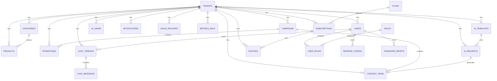

# ERD — ร้าน 100 บาท Marketing AI Platform

แผนภาพความสัมพันธ์ของตาราง (Mermaid). ทุกตารางธุรกิจอ้างอิง `tenant_id`.

```mermaid
erDiagram
    TENANTS ||--o{ USERS : has
    TENANTS ||--o{ PRODUCTS : has
    TENANTS ||--o{ CATEGORIES : has
    TENANTS ||--o{ CAMPAIGNS : has
    TENANTS ||--o{ PROMOTIONS : has
    TENANTS ||--o{ CONTENT_ITEMS : has
    TENANTS ||--o{ AI_REQUESTS : has
    TENANTS ||--o{ AI_TEMPLATES : has
    TENANTS ||--o{ AI_USAGE : has
    TENANTS ||--o{ NOTIFICATIONS : has
    TENANTS ||--o{ CHAT_THREADS : has
    TENANTS ||--o{ SALES_RECORDS : has
    TENANTS ||--o{ METRICS_DAILY : has
    TENANTS ||--o{ SUBSCRIPTIONS : has
    TENANTS ||--o{ INVOICES : has

    USERS ||--o{ USER_ROLES : assigned
    ROLES ||--o{ USER_ROLES : assigned
    USERS ||--o{ REFRESH_TOKENS : owns
    USERS ||--o{ PASSWORD_RESETS : owns
    USERS ||--o{ CHAT_THREADS : starts

    CATEGORIES ||--o{ PRODUCTS : groups
    CAMPAIGNS  ||--o{ PROMOTIONS : contains
    CAMPAIGNS  ||--o{ CONTENT_ITEMS : contains
    AI_TEMPLATES ||--o{ AI_REQUESTS : uses
    AI_REQUESTS  ||--o| CONTENT_ITEMS : generates

    CHAT_THREADS ||--o{ CHAT_MESSAGES : contains
    PLANS ||--o{ SUBSCRIPTIONS : defines
    SUBSCRIPTIONS ||--o{ INVOICES : bills
```

> สร้าง schema จริงได้จาก [`../schema/schema.sql`](../schema/schema.sql)
