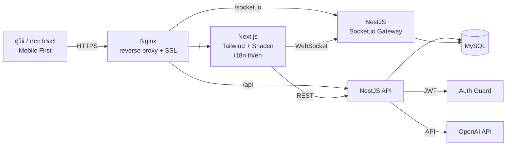

# 01 — สถาปัตยกรรมระบบ (Architecture)

## ภาพรวม
แพลตฟอร์ม AI การตลาดแบบ multi-tenant SaaS สำหรับร้าน 100 บาท
ออกแบบเป็น **monorepo** แยก frontend / backend และใช้ MySQL เป็นฐานข้อมูลกลาง

## แผนภาพระดับสูง (High-level)

## หลักการออกแบบ
- **Mobile First** — UI ออกแบบจากจอเล็กก่อน
- **Thai-first i18n** — ข้อความทั้งหมดผ่าน dictionary (`th` default, `en` future)
- **Multi-tenant** — แยกข้อมูลด้วย `tenant_id` ทุกตาราง + guard ฝั่ง backend
- **Stateless Auth** — JWT access (อายุสั้น) + refresh token (เก็บ hash ใน DB)
- **Realtime** — Socket.io สำหรับ notifications และ AI chat
- **AI as a service** — โมดูล `ai` ห่อ OpenAI API พร้อม template, usage tracking, quota

## ชั้นของระบบ (Layers)
| ชั้น | เทคโนโลยี | หน้าที่ |
| --- | --- | --- |
| Presentation | Next.js + Tailwind + Shadcn | UI/UX, routing ตาม locale |
| API | NestJS (REST) | business logic, validation |
| Realtime | Socket.io Gateway | event-driven updates |
| Data | MySQL | persistence (multi-tenant) |
| External | OpenAI API | content generation |
| Infra | AlmaLinux + Nginx + PM2 | hosting, proxy, process mgmt |

## ความปลอดภัย (สรุป)
- JWT + refresh token rotation
- RBAC (owner/admin/editor/viewer)
- Rate limiting (per IP / per tenant)
- Tenant isolation ทุก query
- Validation ทุก input (DTO)
- Secrets ผ่าน `.env` (ไม่ commit)
