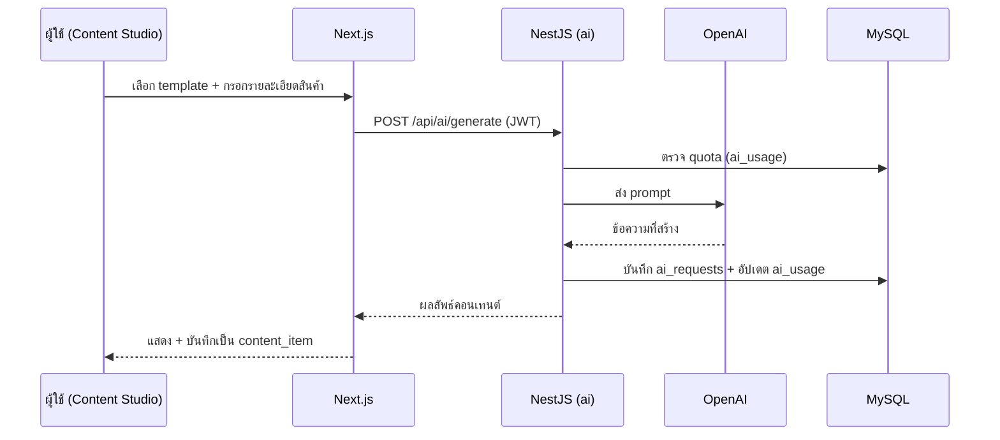

# 04 — Module Overview

## Backend Modules (NestJS)

| Module | ความรับผิดชอบ | Endpoint หลัก (ตัวอย่าง) | ขึ้นกับ |
| --- | --- | --- | --- |
| `auth` | ลงทะเบียน, เข้าสู่ระบบ, refresh, ออกจากระบบ, JWT, guards | `POST /api/auth/login`, `/register`, `/refresh` | users, tenants |
| `users` | จัดการผู้ใช้, โปรไฟล์, RBAC | `GET/POST /api/users` | tenants |
| `tenants` | จัดการร้าน (multi-tenant), ตั้งค่าร้าน | `GET/PATCH /api/tenants/me` | — |
| `products` | สินค้า + หมวดหมู่ | `CRUD /api/products`, `/categories` | tenants |
| `campaigns` | แคมเปญ + โปรโมชั่น | `CRUD /api/campaigns`, `/promotions` | products |
| `content` | คอนเทนต์การตลาด, สถานะ, ตารางเผยแพร่ | `CRUD /api/content` | campaigns, ai |
| `ai` | OpenAI integration, templates, usage/quota | `POST /api/ai/generate`, `GET /api/ai/usage` | content |
| `notifications` | การแจ้งเตือน | `GET /api/notifications`, `PATCH /read` | realtime |
| `analytics` | สถิติ/รายงาน | `GET /api/analytics/overview` | sales |
| `billing` | แพ็กเกจ, subscription, invoice | `GET /api/billing/plan` | tenants |
| `realtime` | Socket.io gateway (events) | `ws /socket.io` | auth |

### Cross-cutting (common/)
- `guards/` — JwtAuthGuard, RolesGuard, TenantGuard
- `interceptors/` — logging, transform response, tenant scoping
- `filters/` — global exception filter (i18n error messages)
- `decorators/` — `@CurrentUser()`, `@CurrentTenant()`, `@Roles()`
- `config/` — env validation (zod/joi)
- `i18n/` — message catalogs (th/en)

---

## Frontend Features (Next.js)

| Feature | หน้าที่ | เส้นทาง (locale-based) |
| --- | --- | --- |
| `auth` | เข้าสู่ระบบ / สมัคร / รีเซ็ตรหัสผ่าน | `/[locale]/login`, `/register` |
| `dashboard` | ภาพรวม KPI, การ์ดสรุป | `/[locale]/dashboard` |
| `content-studio` | สร้างคอนเทนต์ด้วย AI, แก้ไข, จัดตาราง | `/[locale]/content` |
| `campaigns` | จัดการแคมเปญ + โปรโมชั่น | `/[locale]/campaigns` |
| `products` | จัดการสินค้า + หมวดหมู่ | `/[locale]/products` |
| `analytics` | กราฟ/รายงานยอดขาย | `/[locale]/analytics` |
| `chat` | ผู้ช่วย AI แบบเรียลไทม์ | `/[locale]/chat` |
| `settings` | ตั้งค่าร้าน, ผู้ใช้, แพ็กเกจ, ภาษา | `/[locale]/settings` |

### Shared (frontend)
- `components/ui/` — Shadcn UI primitives
- `components/layout/` — AppShell, Sidebar, Topbar (mobile-first)
- `lib/` — `apiClient` (REST), `socket` (Socket.io client), utils
- `stores/` — auth/session, ui state
- `i18n/messages/` — `th.json` (default), `en.json` (future)

---

## การไหลของข้อมูลหลัก (ตัวอย่าง: สร้างคอนเทนต์ด้วย AI)

