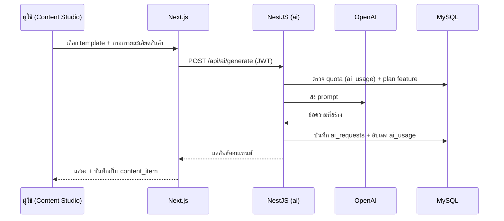

# 04 — Module Overview

## Backend Modules (NestJS)

| Module | ความรับผิดชอบ | Endpoint หลัก (ตัวอย่าง) | ขึ้นกับ |
| --- | --- | --- | --- |
| `auth` | ลงทะเบียน, เข้าสู่ระบบ, refresh, ออกจากระบบ, ลืม/รีเซ็ตรหัสผ่าน, JWT, guards | `POST /api/auth/login`, `/register`, `/forgot-password`, `/reset-password` | users, tenants |
| `users` | จัดการผู้ใช้, โปรไฟล์, RBAC, branch assignment | `GET/POST /api/users` | tenants, branches |
| `tenants` | จัดการร้าน (multi-tenant), ตั้งค่าร้าน | `GET/PATCH /api/tenants/me` | — |
| `products` | สินค้า + หมวดหมู่ | `CRUD /api/products`, `/categories` | tenants |
| `campaigns` | แคมเปญ + โปรโมชั่น (รองรับ branch_id) | `CRUD /api/campaigns`, `/promotions` | products, branches |
| `content` | คอนเทนต์การตลาด, สถานะ, ตารางเผยแพร่ | `CRUD /api/content` | campaigns, ai |
| `ai` | OpenAI integration, templates, usage/quota | `POST /api/ai/generate`, `GET /api/ai/usage` | content, billing |
| `notifications` | การแจ้งเตือน | `GET /api/notifications`, `PATCH /read` | realtime |
| `analytics` | สถิติ/รายงาน, executive summary, branch filter | `GET /api/analytics/summary`, `/executive`, `/sales-by-branch` | sales, branches |
| `billing` | แพ็กเกจ, subscription, invoice lifecycle, feature gating | `GET /api/billing/subscription`, `POST /api/invoices/:id/pay` | tenants, audit |
| `branches` | จัดการสาขา (tenant-scoped) | `CRUD /api/branches` | tenants, audit |
| `erp` | Proxy ChangSiam ERP, sync, AI insights, alerts | `GET /api/erp/dashboard`, `POST /api/erp/sync` | billing (feature gate) |
| `audit` | บันทึกและดู audit logs | `GET /api/audit-logs` | — |
| `chat` | AI chat threads + messages (WebSocket streaming) | `GET /api/chat/threads`, `chat:send` (WS) | ai, realtime |
| `realtime` | Socket.io gateway (events) | `ws /socket.io` | auth |

### Cross-cutting (common/)
- `guards/` — JwtAuthGuard, RolesGuard, PlanFeatureGuard
- `interceptors/` — TransformInterceptor, AuditInterceptor (mutation logging)
- `filters/` — global exception filter (i18n error messages)
- `decorators/` — `@CurrentUser()`, `@Roles()`, `@RequiresFeature()`, `@AuditSkip()`
- `config/` — env validation (Joi)
- `i18n/` — message catalogs (th/en)

---

## Frontend Features (Next.js)

| Feature | หน้าที่ | เส้นทาง (locale-based) | Sidebar section |
| --- | --- | --- | --- |
| `auth` | เข้าสู่ระบบ / สมัคร / ลืมรหัส / ตั้งรหัสใหม่ | `/[locale]/login`, `/register`, `/forgot-password`, `/reset-password` | — |
| `dashboard` | ภาพรวม KPI, executive summary, AI insights | `/[locale]/dashboard` | Intelligence |
| `content-studio` | สร้างคอนเทนต์ด้วย AI | `/[locale]/content` | Marketing |
| `campaigns` | จัดการแคมเปญ + โปรโมชั่น | `/[locale]/campaigns` | Marketing |
| `products` | จัดการสินค้า + หมวดหมู่ | `/[locale]/products` | Marketing |
| `analytics` | กราฟ/รายงานยอดขาย + branch filter | `/[locale]/analytics` | Intelligence |
| `erp` | ข้อมูลยอดขายจริงจาก ChangSiam ERP | `/[locale]/erp` | Intelligence |
| `branches` | จัดการสาขา | `/[locale]/branches` | Operations |
| `chat` | ผู้ช่วย AI แบบเรียลไทม์ | `/[locale]/chat` | Intelligence |
| `audit` | บันทึกกิจกรรมระบบ | `/[locale]/audit` | Operations |
| `settings` | ตั้งค่าร้าน, ผู้ใช้, แพ็กเกจ, billing | `/[locale]/settings` | Operations |

### Sidebar grouping (nav-config.ts)
- **Intelligence** — Dashboard, Analytics, ERP, AI Chat
- **Marketing** — Content Studio, Campaigns, Products
- **Operations** — Branches, Activity Log, Settings

### Shared (frontend)
- `components/ui/` — Shadcn UI primitives
- `components/layout/` — AppShell, Sidebar (grouped nav), Topbar
- `lib/` — REST clients (`api.ts`, `*-api.ts`), `socket.ts`
- `stores/` — auth/session, ui state
- `i18n/messages/` — `th.json`, `en.json`

---

## การไหลของข้อมูลหลัก (ตัวอย่าง: สร้างคอนเทนต์ด้วย AI)

